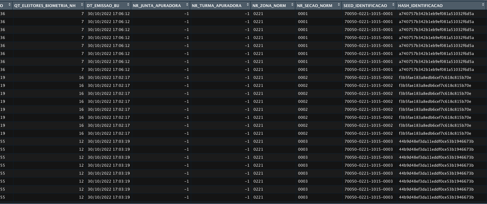

# Sumário

* [Introdução](#introdução)
* [Objetivo](#objetivo)
* [Dados utilizados](#dados-utilizados)
* [Problema apresentado no relatório](#problema-apresentado-no-relatório)
* [Encontrando o problema apresentado nas fontes de dados](#encontrando-o-problema-apresentado-nas-fontes-de-dados)
    * [Importando os Dados para Análise](#importando-os-dados)
    * [Gerando uma tabela de frequencias dos Identificadores Iniciais](#gerando-uma-tabela-de-frequencias-dos-identificadores-iniciais)
* [Simulação e Auditoria de Dados](#simulação-de-auditoria-de-dados)
    * [Data Minning e Enriquecimento dos Dataframes](#data-minning-e-enriquecimento-dos-dataframes)
    * [Hashing de Identificação de Urnas através da metadados categóricos](#hashing-de-identificação-de-urnas-através-da-metadados-categóricos)
    * [Comparação da Auditoria via ID e Auditoria via Hashing de urnas](#comparação-da-auditoria-via-id-e-auditoria-via-hashing-de-urnas).
    * [Comparação da Auditoria via ID e Auditoria via Hashing dos modelos apontados como “problemáticos”](#comparação-da-auditoria-via-id-e-auditoria-via-hashing-dos-modelos-apontados-como-problemáticos)
* [Game Days de Auditoria](#gamedays-de-auditoria---sempre-em-construção)
    * [Correlação entre Urna Identificada vs Boletim de Urna](#correlação-entre-urna-identificada-vs-boletim-de-urna)
    * [Me diga qual, urna estava na seção X do local Y da zona Z?](#me-diga-qual-urna-estava-na-seção-x-do-local-y-da-zona-z)
    * [Me dê somente os logs de determinada urna](#me-dê-somente-os-logs-de-uma-determinada-urna)
* Conclusão

# Introdução 

A partir das constantes ações do **Partido Livre (PL)**, liderado  atualmente por **Valdemar da Costa Neto**, para desqualificar o processo eleitoral e descredibilizar as instituições afim de garantir mais um mandato para seu candidato **Jair Messias Bolsonaro** por meios não democráticos, foram apresentados uma série de relatórios e discursos afim de alegar a **total impossibilidade** de auditoria das urnas cujos modelos são anteriores a 2020.

Será apresentado uma prova de conceito afim de criar um hash único de trabalho das urnas para identificá-las e diferenciá-las nas análises de logs para auditoria unitária ou em massa, e também correlacionar as mesmas em outros datasets e boletins públicos. 

Importante ressaltar que essa análise e proposta de auditoria e identificação de urnas, é feita inicialmente por um civil, por vontade própria, livre que qualquer financiamento de qualquer grupo ou partido político. Afins de estabelecer modelos técnicos para auditoria de dados e resultados. 

# Objetivo

O Objetivo desta análise é exemplificar que é possível, sim, auditar todos os modelos de urnas eletrônicas sem a necessidade da identificação da mesma via log. 

Serão apresentadas tecnicas e ferramentas de mercado, ferramentas de análise estatística e ciência da dados com exemplos praticos e com todos os scripts de análise e datasets públicos e abertos. 

Tanto quanto os dados, todas as ferramentas utilizadas são Open Source e estão disponíveis para para todos acessarem e utilizarem de forma livre. 

# Problema apresentado no relatório

Esta prova de conceito foi construída com base no relatório preeliminar emitido pelo PL no dia 15/11/2022 e no relatório consolidado emitido dia 22/11/2022.

Ambos o relatórios apresentam pontos de auditoria referentes aos modelos anteriores ao UE2022, contestando a falta de possibilidade de auditar e correlacinar dados. 

> Arquivo digital Log de Urna: um prontuário digital que requer a autenticação em cada linha de
registro de atividade"

> Cada urna eletrônica gera o seu respectivo arquivo digital LOG cuja razão fundamental de existir é
registrar, como num prontuário médico, em cada linha do arquivo, uma atividade realizada pela
urna, naquele dado instante. Cada linha do LOG inclui duas informações essenciais e necessárias,
para validação do registro, lidas diretamente do hardware:
> * carimbo de tempo, composto por data e hora:minuto:segundo, lidos do relógio do
equipamento
> * código de identificação da urna eletrônica, lido da memória permanente e indelével (ROM)
do equipamento"


O objetivo do relatório claramente não é gerar uma investigação para que o Supremo Tribunal Eleitoral (STE) possa responder tecnicamente, e apresentar alternativas para a possibilidade de auditoria e correlação através de fallbacks sistêmicos. Pois no proprio documento preeliminar, é clara a intenção do Partido Liberal (PL) de invalidar os votos dos cidadãos que exerceram seu papel democrático de escolha de representantes públicos, afim de eleger o eventual candidato de seu partido, Jair Messias Bolsonaro. 

>  "A partir disso, conclui que "os votos válidos e auditáveis do segundo turno" atestariam
resultado diferente e dariam 51,05% dos votos a Bolsonaro. O documento indica que as
urnas 2020 seriam as únicas que teriam "elementos de auditoria válida e que atestam a
autenticidade do resultado eleitoral com a certeza necessária – na concepção do próprio
Tribunal Superior Eleitoral"

> "Nesta perspectiva técnica, não é possível validar os resultados gerados em todas as urnas
eletrônicas de modelos 2009, 2010, 2011, 2013 e 2015, resultados estes que deveriam ser
desconsiderados na totalização das eleições no segundo turno, em função do mau
funcionamento desta urnas.

> Nada mais havendo a considerar damos por encerrado este relatório"

### Referências

[Relatório Técnico Preliminar - Logs Inválidos das Urnas Eletrônicas - Fiscalização das Eleições de 2022 no TSE - por Partido Liberal (PL) - 15/11/2022](https://cdn.oantagonista.com/uploads/2022/11/PL-Relatorio-Tecnico-Logs-Invalidos-das-Urnas-Eletronicas-v0.7-15-11-2022.pdf)

[Adendo ao Relatório Técnico Mau Funcionamento das Urnas Eletrônicas  - Fiscalização das Eleições de 2022 no TSE - por Partido Liberal (PL) - 23/11/2022](https://cdn.oantagonista.com/uploads/2022/11/PL-Adendo-ao-Relatorio-Tecnico-sobre-o-Mau-Funcionamento-das-Urnas-Eletronicas-v1.5-22-11-2022.pdf)


# Dados Utilizados

Para a realização das análises vamos utilizar as mesmas fontes de dados utilizadas no relatório do PL. Embora numa condição menor em termos de amostras por conta de limitações de hardware. 

Serão analisadas 20 Urnas eletronicas da cidade de Salto - São Paulo, sendo 16 delas anteriores ao modelo EU2022

### Referências dos Dados

[Resultados das Urnas - Resultados TSE](https://resultados.tse.jus.br/oficial/app/index.html#/eleicao;e=e545;uf=sp;ufbu=sp;mubu=70050;zn=0221;se=0004/dados-de-urna/log-da-urna)

[Boletim das Urnas - Dados Abertos](https://dadosabertos.tse.jus.br/dataset/resultados-2022-boletim-de-urna)


# Encontrando o problema apresentado nas fontes de dados

Para iniciarmos a análise vamos tentar chegar na mesma conclusão que os analistas contratados pelo PL chegaram no relatório preliminar. Encontrar o campo que foi apontado como problemático. 

Realizei o Download de logs de 20 urnas usadas em 20 seções eleitorais da cidade de Salto, São Paulo. Cidade na qual resido. Codigo Municipio 70050.

Os arquivo estão na [extensão .dat](https://www.reviversoft.com/pt/file-extensions/dat). Arquivos em texto simples que estavam separando as variáveis das observações a partir da tabs. 

Feita a primeira análise a olho nú, precisei identificar o chartset para fazer a futura análise com a devida qualidade. O mesmo se encontrava em charset [iso-8859-1](https://pt.wikipedia.org/wiki/ISO/IEC_8859-1). 


## Importando os Dados

Para executar a análise vou estar utilizando o ferramental da [linguagem R](https://rlang.r-lib.org), linguagem normalmente utilizada para realizar tarfas de Estatística, Machine Learning, e Data Science. 

O primeiro passo foi juntar todos os datasets reunidos das urnas em um unico dataframe para ajudar na manipulação e análise. 

```r
datasets_logs <- c(
  "logd-00407-0001.dat",
  "logd-00407-0002.dat",
  "logd-00407-0003.dat",
  "logd-00407-0004.dat", 
  "logd-00407-0005.dat",
  "logd-00407-0006.dat",
  "logd-00407-0007.dat",
  "logd-00407-0008.dat",
  "logd-00407-0009.dat",
  "logd-00407-0010.dat",
  "logd-00407-0011.dat",
  "logd-00407-0012.dat",
  "logd-00407-0013.dat",
  "logd-00407-0014.dat",
  "logd-00407-0015.dat",
  "logd-00407-0028.dat",
  "logd-00407-0075.dat",
  "logd-00407-0122.dat",
  "logd-00407-0147.dat",
  "logd-00407-0253.dat"
)

## Criando um Dummy Dataset vazio
logs <- read.table(datasets_logs[1], 
                  header=FALSE, 
                  skip=0, 
                  sep="\t", 
                  nrows = 1,
                  fileEncoding="iso-8859-1"
)

## ...

for (d in datasets_logs) {
  tmp <- read.table(d, 
          header=FALSE, 
          skip=0, 
          sep="\t", 
          fileEncoding="iso-8859-1"
  )
  logs <- rbind(logs, tmp)
}
```

Os arquivos possuem 6 colunas. Contendo principalmente o `datetime` do log, o `log level` algo que a priori parece ser o identificador único da urna, apontado como fator impossibilitador de auditorias pelo relatório, a linha de log propriamente dita e um identificador único que parece ser o log. 


## Gerando uma tabela de frequencias dos Identificadores Iniciais

Vamos gerar uma tabela de frequencias, para contar a ocorrencia de cada linha de log separando pelos id's de urna encontrados no campo `V3`.

```r
initial_table <- table(logs$vV)
initial_table
```


Como foram importados dados de 20 urnas distintas, eram esperados logs agrupados de 20 identificadores, porém temos uma quantidade muito discrepante de logs a partir do Identificador `67305985`. Mesmo ID apontado no relatório. Por fim chegamos na linha de raciocinio do relatório. De 20 observações, 16 estão apresentando logs com o mesmo identificador. Dado esse ponto, é dito pela consultoria, em nome do Partido Liberal, que seria terminantemente impossível utilizar os logs para auditar as urnas e conferir informações. 

O objetivo dessa análise é aplicar técnicas de mercado exploratórias para não só conseguir auditar e checar votos, como também enriquecer os dados além da informação bruta para análises estatísticas, aplicar modelos de Machine Learning e enriquecer ainda mais os datasets públicos e confiabilidade. 

Veremos como nos passos a seguir. 


# Simulação de Auditoria de Dados

A partir deste ponto, vou guiar a análise como se eu mesmo, assumindo um papel de auditor ou cientista de dados, precisasse estabelecer formas de gerar informação útil com a massa de dados para análises em escala. 

## Data Minning e Enriquecimento dos Dataframes

Como os arquivos de logs são verbosos mas não possuem muitas observações em na dimensão de variáveis, a ideia inicial é percorrer superficialmente os dados gerados nas linhas de logs para ver que tipo de informações encontramos. 

Usando um editor de texto, abrimos um dos arquivos da amostra, encontramos informações interessantes como `Modelo de Urna`, `Município`, `Zona Eleitoral`, S`eção Eleitoral`, `Local de Votação`


Para um check-up mais leigo, esses dados já serviriam. Pois o próprio Tribunal Supreno Eleitoral utiliza a sequencia de `Municipio`/`Zona`/`Seção` para se organizar e disponibilizar os dados no portal. 


Vamos normalizar e enriquecer as linhas de log do Dataframe. 

Para realizar essa ação, vamos utilizar o ferramental para aplicar Regex nas linhas de logs procurando por determinadas ocorrencias de padrão de texto, e recuperando os valores. 

Antes disso, vamos criar e renomear as variáveis do dataframe para uma melhor identificação visual e facilitar a manipulação dos dados. 

```r
# ...
names(logs) <- c("datetime", "log_level", "id_urna", "cod", "log", "log_id", "modelo_urna", "municipio", "zona_eleitoral", "local_votacao", "secao_eleitoral")
# ...
```

Em seguida vamos reimportar todos os datasets, já percorrendo cada um deles e aplicando as regras de regex, normalização para as novas variáveis a partir dos valores recuperados. 


```r
## Fazendo o merge de todos os datasets
for (d in datasets_logs) {
  tmp <- read.table(d, 
          header=FALSE, 
          skip=0, 
          sep="\t", 
          fileEncoding="iso-8859-1"
  )
  names(tmp) <- c("datetime", "log_level", "id_urna", "cod", "log", "log_id")
  
  ## Enriquecimento inicial - Numero do modelo da urna
  str_find_pattern <- "Identificação do Modelo de Urna: "
  tmp$modelo_urna <- str_remove(grep(str_find_pattern, tmp$log,  value = TRUE)[1],str_find_pattern)
  
  ## Enriquecimento inicial - Municipio
  str_find_pattern <- "Município: "
  tmp$municipio <- str_remove(grep(str_find_pattern, tmp$log,  value = TRUE)[1],str_find_pattern)
  
  ## Enriquecimento inicial - Zona Eleitoral
  str_find_pattern <- "Zona Eleitoral: "
  tmp$zona_eleitoral <- str_remove(grep(str_find_pattern, tmp$log,  value = TRUE)[1],str_find_pattern)
  
  ## Enriquecimento inicial - Local de Votação
  str_find_pattern <- "Local de Votação: "
  tmp$local_votacao <- str_remove(grep(str_find_pattern, tmp$log,  value = TRUE)[1],str_find_pattern)
  
  ## Enriquecimento inicial - Sessão Eleitoral
  str_find_pattern <- "Seção Eleitoral:"
  tmp$secao_eleitoral <- str_trim(
    str_remove(grep(str_find_pattern, tmp$log,  value = TRUE)[1],str_find_pattern), 
    side = c("both", "left", "right")
  )
  
  logs <- rbind(logs, tmp)
}

```

A partir desse ponto, já evoluimos nosso dataframe 

### A partir desse ponto, evoluimos o dataframe disso:


### Para isso, um dataframe mais rico e amigável:


Portanto vamos explorar estatisticamente essa transformação para validarmos se está cobrindo o total de 20 observações de urnas. 

Primeiramente vamos avaliar a quantidade de seções eleitorais. 


#### Quantidade de Modelos

Inicialmente conseguimos identificar a quantidade de modelos de urnas utilizados na amostra, totalizando 

| Modelos   | Quantidade    | %     |
|-----------|---------------|-------|
| UE2009    | 8             | 40%   |
| UE2010    | 6             | 30%   |
| UE2015    | 2             | 10%   |
| UE2020    | 4             | 20%   |


#### Logs por Modelo de Urna

Uma observação ainda crua, mas que já pode ser extraída é a quantidade de logs por cada modelo de urna observado


#### Logs por Seção Eleitoral

Por fim conseguimos pela primeira vez identificar 20 observações de 20 urnas a partir do enriquecimento dos dados que mineramos dos logs


# Hashing de Identificação de Urnas através da metadados categóricos

A partir do momento que coletamos dados minerados, podemos começar a pensar numa forma de gerar um identificador único para cada modelo de urna através de uma tecnica de [Hashing](https://pt.wikipedia.org/wiki/Função_hash) de metadados. 

Uma função hash é um algoritmo que mapeia dados de comprimento variável para dados de comprimento fixo. Os valores retornados por uma função hash são chamados valores hash, códigos hash, somas hash, checksums ou simplesmente hashes

As técnica de Hashing é amplamente conhecida em diversas áreas e tem muitos usos dentro do universo de tecnologia e engenharia de software. Mas principalmente para garantir integridade de algum dado. O conceito de Hash para olhos mais leigos é: `transformar uma grande quantidade de dados, em uma pequena quantidade de informações`. 

Basicamente trocar um numero grande de caracteres, palavras, números por um hash correspondente aquele dados sem volta. Apenas sendo possível chegar ao resultado inicial através de `colisão`. 

Um exemplo prático, sem relação com a análise: 

```bash

❯ echo "AAAAAAAAAAAAAAAAAAAA" | md5
0a1f01f5d83b5dc40dec529fffdb3e6d


❯ echo "Lorem ipsum dolor sit amet, consectetur adipiscing elit. Quisque sit amet lorem nec tortor venenatis vulputate. Donec eu pretium leo. Cras auctor tristique mi ut pharetra. Proin eget nulla id risus vestibulum dictum porttitor vel mauris." | md5
145ff0b0832aaf363cb04eb80cd6ac82

```

Dessa forma conseguimos fornecemos uma string pequena, ou gigante, como argumento para uma função hash, neste caso, `MD5`, e ela nos retorna o conjunto de caracteres correspondentes em formato de hash. 

Esta técnica é utilizada para checar integridade, pois se 1 byte for alterado, o resultado do hashing é completamente diferente. 

Exemplo: 

```bash
❯ echo "AAAAAAAAAAAAAAAAAAAA" | md5
0a1f01f5d83b5dc40dec529fffdb3e6d

❯ echo "AAAAAAAAAAAAAAAAAAAa" | md5
7159e41ca576aef10be31376206dbd86

❯ echo "AAAAAAAAAAAAAAAAAAAB" | md5
b8a1a140172867f6d0d3a07fa7e7310c
```

O objetivo é utilizar os metadados que não mudam, e não se repetem inicialmente em hashes e gerar um novo identificador único para a urna de determinada seção eleitoral. 

### Criando um Hashing Identificador para a Urna / Seção 

Vamos gerar uma seed de caracteres concatenando informações como `municipio`, `zona_eleitoral`, `local_votacao`, `secao_eleitoral`, `modelo_urna`, `id_urna`. 

dessa forma `MUNICIPIO-ZONA-LOCAL-SECAO-MODELO-ID`, tendo um resultado final parecido com `70050-0221-1015-0001-UE2020-2122186`, e logo depois criar um outro campo no nosso dataframe chamado `hash_urna`, onde vamos armazenar o nosso identificador único. Dessa forma conseguindo ver de qual urna """hasheada""", veio determinado log. Para relizar isso vamos usar a biblioteca `digest` do `R`. 


```r
## Gerando uma seed para vincular a auditoria das urnas
logs$urna_seed <- paste(
  logs$municipio,
  logs$zona_eleitoral,
  logs$local_votacao,
  logs$secao_eleitoral,
  logs$modelo_urna,
  logs$id_urna, 
  sep = "-")

logs$hash_urna <- sapply(logs$urna_seed, digest, algo="md5")
```


# Comparação da Auditoria via ID e Auditoria via Hashing de urnas

Primeiramente vamos gerar a comparação com base no erro apontado do PL de não identificacão, se baseando no dado que chamamos de `id_urna`. Vamos gerar a tabela de frequencia dos logs baseados nesse valor

```r
## Tabela de frequencias id_urna
freq_table_id <- sort(table(logs$id_urna))
freq_table_id <- as.data.frame(freq_table_id)
names(freq_table_id) <- c("id_urna", "frequencia")
freq_table_id
```


Agora vamos aplicar a mesma tecnica baseado no nosso campo identificador `hash_urna`. 

```r
## Tabela de frequencias - hash_urna
freq_table_hash <- sort(table(logs$hash_urna))
freq_table_hash <- as.data.frame(freq_table_hash)
names(freq_table_hash) <- c("identificado_urna", "frequencia")
freq_table_hash
```


Dessa forma conseguimos chegar num identificador da urna em seu horário de atividade. Conseguimos identificar e trabalhar nos dados da mesma através do campo que substituimos com o `hash_urna`. 


# Comparação da Auditoria via ID e Auditoria via Hashing dos modelos apontados como “problemáticos”

A ideia deste tópico é realizar o mesmo teste de frequencia mas tendo como amostra somente os modelos anteriores anteriores ao `UE2022` cujo identificador foi dado como impecilho para validação dos dados. 

Primeiro passo é selecionar somente os modelos com o `id_urna` igual a `67305985`. 

```r
### Codigo das urnas apontado como erro
codigo_urna_analise <- 67305985
urnas_analise <- subset(logs, id_urna == codigo_urna_analise)
```

Segundo passos é repetir o teste da tabela de frequencia para pegar as urnas "não identificáveis"

```r 
### Tabela de frequencia do id_urna dos modelos antigos
freq_table_urnas_analise <- table(urnas_analise$id_urna)
freq_table_urnas_analise <- as.data.frame(freq_table_urnas_analise)
names(freq_table_urnas_analise) <- c("id_urna", "frequencia")
freq_table_urnas_analise
```

Geramos o gráfico de teste


Terceiro passo é gerar a tabela de frequência com as urnas agora, identificáveis

```r
### Tabela de frequencia do hash_urna dos modelos antigos
freq_table_urnas_analise <- table(urnas_analise$hash_urna)
freq_table_urnas_analise <- as.data.frame(freq_table_urnas_analise)
names(freq_table_urnas_analise) <- c("hash_urna", "frequencia")
freq_table_urnas_analise
```


# GameDays de Auditoria - Sempre em Construção

Essa seção é feita para validarmos o modelo de auditoria respondendo a perguntas que um auditor faria. A ideia não é usar apenas a tecnica de hashing, mas também vários modelos de Machine Learning para exploração dos dados. 

-----

## Correlação entre Urna Identificada vs Boletim de Urna

Um teste interessante é correlação entre o Boletim de Urna e a própria Urna. O Boletim de Urna é um dataset totalmente diferente dos logs, disponibilizado de outra fonte, ainda do TSE. 

Os boletins são emitidos por estado. Sendo assim iremos realizar o teste com base no boletim do Segundo Turno de São Paulo.

[Boletim das Urnas - SP - Boletim de Urna - Segundo turno - 31.10.2022
](https://dadosabertos.tse.jus.br/dataset/resultados-2022-boletim-de-urna/resource/5729e0c0-c756-4ecf-8556-d98340135428)


Primeiro passo é importar o boletim, que veio em formato CSV diferente dos logs que são distribuídos em DAT. 

```r
boletim <- read.csv("bweb_2t_SP_311020221535/bweb_2t_SP_311020221535.csv", 
                    sep = ";", 
                    dec = ".", 
                    fileEncoding="iso-8859-1"
)

colnames(boletim)
```


Durante a primeira análise podemos ver que o número de informações em forma de variáveis do boletim é bem maior que o dos logs de forma crua. Porém não temos informações como `codigo da urna`, `modelo da urna`. 

Mas temos informações que podemos cruzar com o outro dataset dos logs, como `CD_MUNICIPIO`, `NR_ZONA`,  `NR_SECAO`, `NR_LOCAL_VOTACAO`

### Hashing do Boletim

Antes de aplicarmos a tecnica de hashing, vamos efetuar alguns procedimentos para facilitar o cruzamento dos dados. A primeira dessas coisas será efetuar a normalização de alguns campos para que fiquem iguais aos que existem nos logs.

```r
# Normalizando o NR_ZONA com padding de 4 zeros
boletim$NR_ZONA_NORM <- sprintf("%04d",boletim$NR_ZONA)

# Normalizando o NR_SECAO com padding de 4 zeros
boletim$NR_SECAO_NORM <- sprintf("%04d",boletim$NR_SECAO)

colnames(boletim)
```

Em seguida vamos recuperar somente os boletins do Municipio isolado da amostra, sendo ele `70050` da cidade de Salto, São Paulo. 

```r
boletim_salto_sp <- subset(boletim, CD_MUNICIPIO == 70050)
boletim_salto_sp
```

Vamos aplicar a tecnica de hashing inicialmente no primeiro dataframe dos logs. Inicialmente criando uma seed e posteriormente gerar um hash `MD5` dela no campo `hash_identificacao_boletim`. Vamos utilizar somente as informações que existem no boletim.

```r
logs$boletim_seed <- paste(
  logs$municipio,
  logs$zona_eleitoral,
  logs$local_votacao,
  logs$secao_eleitoral,
  sep = "-")


## Gerando um hash de identificação do Boletim
logs$hash_identificacao_boletim <- sapply(logs$boletim_seed, digest, algo="md5")
```

O mesmo passo será repetido no dataframe do Boletim de Urna. 

```r
boletim_salto_sp$SEED_IDENTIFICACAO <- paste(
  boletim_salto_sp$CD_MUNICIPIO,
  boletim_salto_sp$NR_ZONA_NORM,
  boletim_salto_sp$NR_LOCAL_VOTACAO,
  boletim_salto_sp$NR_SECAO_NORM,
  sep = "-"
)

## Gerando a hash de identificação da urna no boletim
boletim_salto_sp$HASH_IDENTIFICACAO <- sapply(boletim_salto_sp$SEED_IDENTIFICACAO, digest, algo="md5")
```

Criamos agora o campo `HASH_IDENTIFICACAO` no Boletim de Urna. 



Agora precisamos criar um dataframe de join, isolando todos os `hash_urnas`

```r
# Separando os hashes unicos pra melhorar a performance do update do dataset
unique_hashes <- logs %>% distinct(hash_identificacao_boletim, hash_urna, hash_urna, modelo_urna)
unique_hashes <- as.data.frame(unique_hashes)
unique_hashes
```

Agora vamos percorrer esse data frame de comparação para fazer um update em todas as linhas do Boletim que fizeram parte da contabilização das urnas utilizadas na amostra, adicionando 

```r
# Adicionando as informações da urna no boletim com base no HASH_IDENTIFICAO

# Adiciona o HASH_URNA e MODELO_URNA
for (i in 1:nrow(unique_hashes)) {
  h <- unique_hashes[i, "hash_identificacao_boletim"]
  boletim_salto_sp$HASH_URNA[boletim_salto_sp$HASH_IDENTIFICACAO == h] <- unique_hashes[i, "hash_urna"]

  boletim_salto_sp$MODELO_URNA[boletim_salto_sp$HASH_IDENTIFICACAO == h] <- unique_hashes[i, "modelo_urna"]  
}
```

Agora vamos isolar as linhas do boletim que correspondem as nossas urnas de amostra

```r
# Removendo as urnas que não foram incluídas na análise
boletim_salto_sp_amostra <- as.data.frame(boletim_salto_sp[rowSums(is.na(boletim_salto_sp)) == 0,])
table(boletim_salto_sp_amostra$HASH_IDENTIFICACAO)
```

Agora vamos checar se conseguimos correlacionar a amostra com seu devido boletim. 

```r
boletim_salto_sp_amostra_resumido <- boletim_salto_sp_amostra %>% 
  select(HASH_URNA, MODELO_URNA, DS_ELEICAO, DS_CARGO_PERGUNTA, DS_TIPO_VOTAVEL, NM_VOTAVEL, QT_VOTOS)

View(boletim_salto_sp_amostra_resumido)
```


Agora conseguimos saber de qual urna foram apuradas as informações do Boletim. 

-----

## Me diga qual, urna estava na seção X do local Y da zona Z??

Para responder isso podemos criar um subset baseado nos critérios levantados. 

```r
## "Me diga qual urna estava na seção X do local Y da zona Z"

urna_x <- subset(logs, secao_eleitoral == "0001" | local_votacao == "1015" | zona_eleitoral == "0221")
urna_x_view <- urna_x %>% select(hash_urna,datetime, modelo_urna, municipio, zona_eleitoral, secao_eleitoral)

View(head(urna_x_view, 1))
```


-----

## Me dê somente os logs de uma determinada urna!

Para responder essa pergunta podemos criar um subset procurando pela respectiva hash_urna. 

```r
## "Me dê somente os logs da urna hash_id:1a2097e964d5e77e355e30744484aa2c"

urna_x <- subset(logs, hash_urna == "1a2097e964d5e77e355e30744484aa2c")
urna_x_view <- urna_x %>% select(hash_urna,datetime, modelo_urna, municipio, zona_eleitoral, secao_eleitoral,  log)

View(urna_x_view)
```


-----
